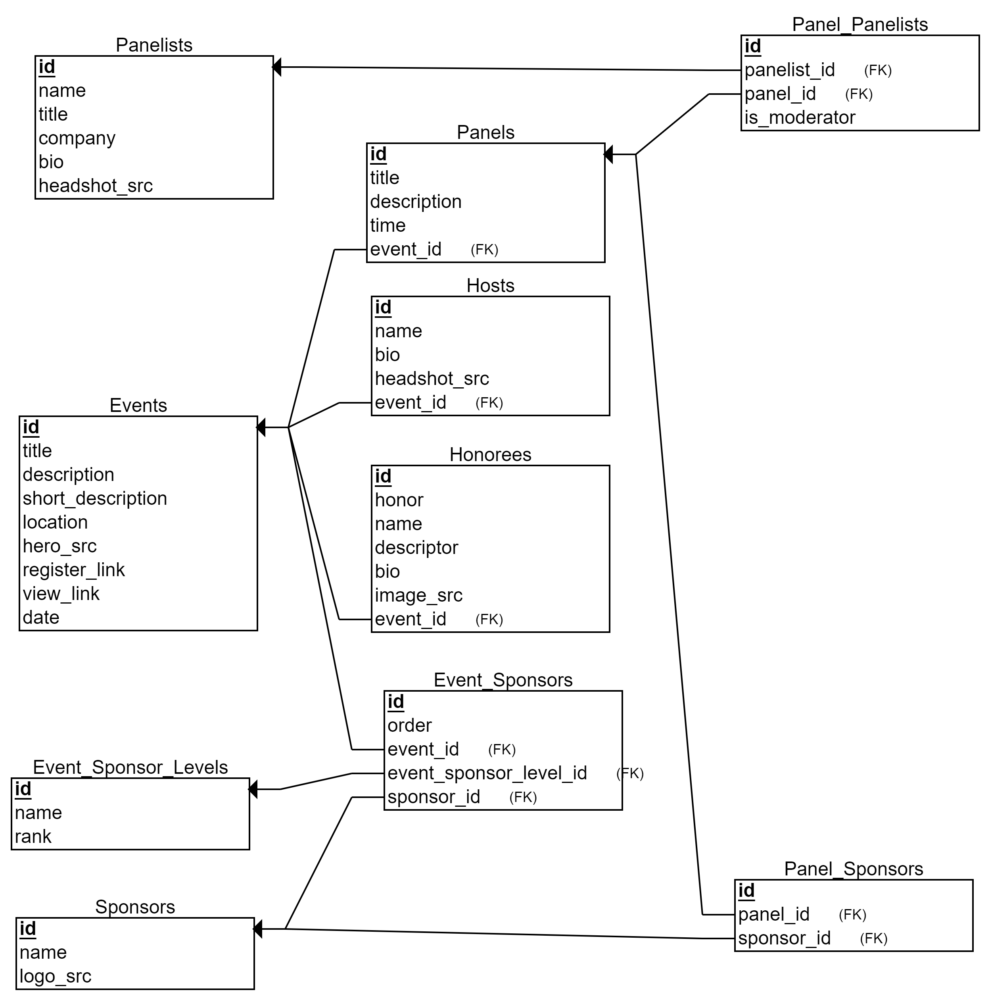

# Event Page Creator - Backend / Server

This is the backend for a simple proof-of-concept event page creator. It is designed to let you build events with:

- Hosts
- Honorees
- Panels & Panelists
- Sponsors of different levels

For the client / frontend of this application, see [joedietrich-dev/event-page-client](https://github.com/joedietrich-dev/event-page-client).

## Inspiration

I was inspired to build this when I was tasked with repeatedly hand-coding landing pages in simple html. This was ineffecient in terms of time spent and meant I was the only person around able to maintain the pages or make any changes. I set out to create a proof-of-concept / MVP event page builder. It has nearly all the entities I need to build those hand-coded pages.

Since this was a proof-of-concept, the design of the app itself could be improved. It also lacks much validation on the front or back end, and has no authentication. All of these would need to be implemented before using this in any sort of production application. With additional time, I would also want to implement uploading the images involved with an event, rather than passing in urls.

## Libraries/Tools Used (Frontend)

- [Sinatra](http://sinatrarb.com/) - a domain-specific language used to build the API framework for the app
- [ActiveRecord](https://guides.rubyonrails.org/active_record_basics.html) - Rails' ORM, here used with Sinatra to map the Ruby classes to the database
- [SQLite](https://www.sqlite.org/index.html) - the database engine used in this project
- [Rake](https://github.com/ruby/rake) - to run commands on the command line
- [Faker](https://github.com/faker-ruby/faker) - used to build out seed data

For additional details, see the Gemfile for this project.

## Getting Started

1. Clone this repository and install its dependencies
2. Create the database and all tables required by running `bundle exec rake db:migrate`
3. Seed the database by running `bundle exec rake db:seed`
4. Clone the [frontend repository](https://github.com/joedietrich-dev/event-page-client) and install its dependencies
5. Start the server by running `bundle exec rake server`
6. Start the frontend follow the directions in its readme file

## Entity Relationships

